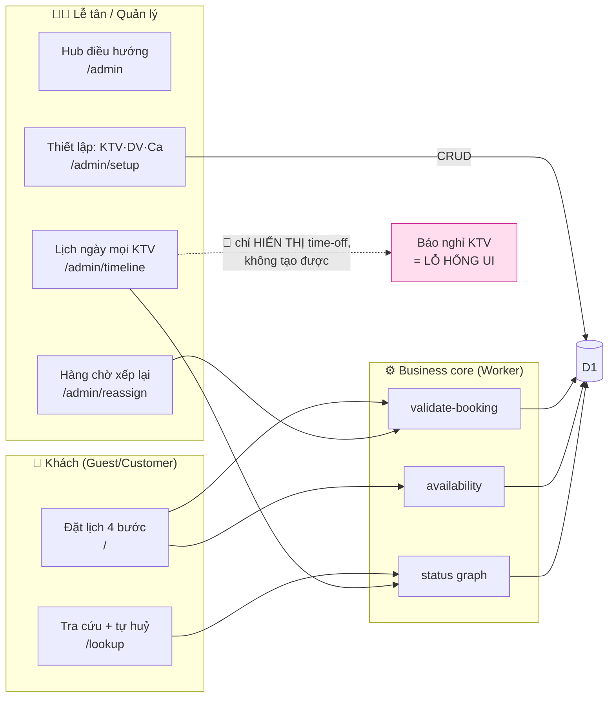
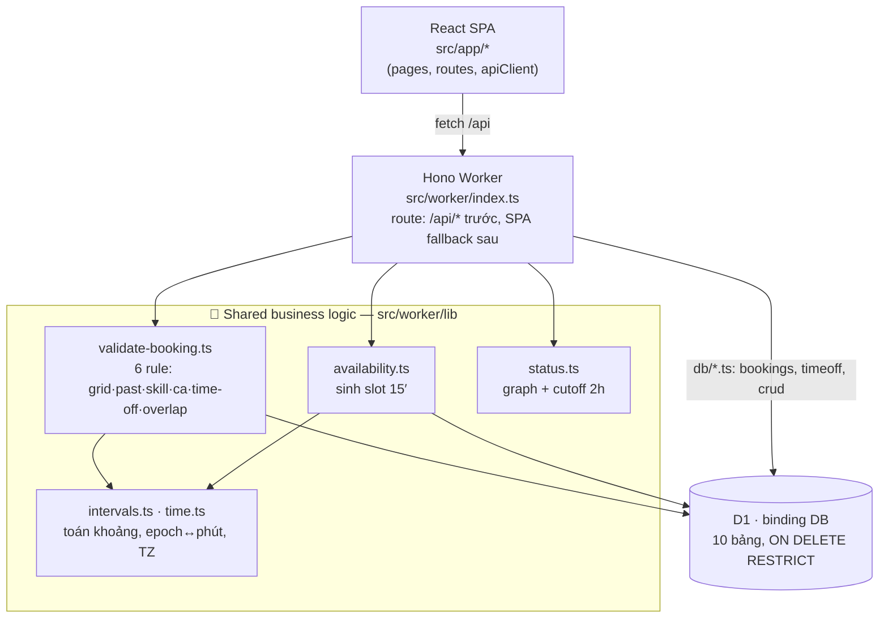
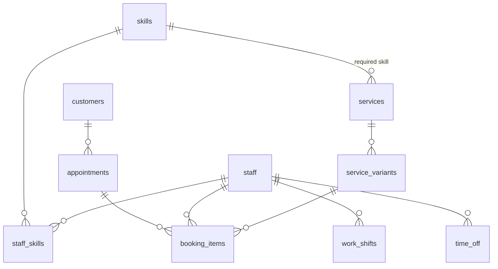

# Bản đồ ứng dụng CCF-2-SPA — theo feature & actor

> Nguồn: scout song song 4 mặt (source / worker / schema / docs+tests) + cross-check trực tiếp trên code.
> Chỉ kết luận từ implementation thật; chỗ docs ≠ code đánh dấu 🔶 UNKNOWN/CONFLICT.
> Git snapshot khi lập map: `main` · `c31f54f` · working tree gần sạch.

**Stack:** React 19 + React Router 7 (SPA) → Hono trên Cloudflare Worker → D1 (binding `DB`, db `ccf-spa`).
**Test:** Vitest (chạy trong workerd + D1 thật) + Playwright. **Deploy:** Cloudflare Workers Builds tự động khi push `main`.
**Auth:** KHÔNG có ở v1 — mọi route (kể cả `/admin/*`) đều mở.

---

## 1. Actor → feature (toàn app một nhìn)

---

## 2. Feature strips: User outcome → UI → API → Rule → Data → Evidence

### 👤 Khách hàng

| # | Outcome | UI | API | Business rule | Data | Evidence |
|---|---------|-----|-----|---------------|------|----------|
| **F1** | Đặt lịch spa qua 4 bước (dịch vụ→variant→giờ→xác nhận) | `/` `BookingPage` | `GET /api/services`, `GET /api/availability?variant_id&date[&staff_id]`, `POST /api/bookings` | Grid 15′; không đặt quá khứ; KTV phải đủ skill; block `[start,block_end)` nằm trọn 1 ca; không đè time-off; không double-book; auto-assign KTV ít phút nhất (tie → id nhỏ). Chống race bằng `INSERT…WHERE NOT EXISTS` | `appointments`, `booking_items`, `customers` | ✅ API + E2E |
| **F2** | Tra cứu lịch bằng SĐT + tự huỷ | `/lookup` `LookupPage` | `GET /api/bookings?phone=`, `POST /api/bookings/:id/cancel` | Định danh yếu = SĐT; huỷ chỉ khi **≥2h** trước giờ, server tự tính (không tin client) | `booking_items.status→cancelled` | ✅ API + E2E |

### 🧑‍💼 Lễ tân / Quản lý

| # | Outcome | UI | API | Business rule | Data | Evidence |
|---|---------|-----|-----|---------------|------|----------|
| **F3** | Hub điều hướng 4 khu | `/admin` `AdminPage` | — (link tĩnh) | — | — | ✅ E2E |
| **F4** | Xem lịch ngày mọi KTV, đổi trạng thái booking (booked→in_service→done/no_show), thấy đếm hàng chờ | `/admin/timeline` `TimelinePage` | `GET /api/admin/schedule?date=`, `GET /api/admin/reassign-queue`, `POST /api/admin/bookings/:id/status` | Status graph: `booked→{in_service,cancelled,no_show}`, `in_service→done`; buffer vẽ đuôi nhạt | `booking_items`, `time_off` (chỉ đọc) | ✅ API + E2E |
| **F5** | Xử lý booking mồ côi do KTV nghỉ: gọi khách → xếp KTV khác / huỷ | `/admin/reassign` `ReassignQueuePage` | `GET reassign-queue`, `GET .../reassign-candidates`, `POST .../reassign`, `POST .../cancel` | Reassign **re-validate y như đặt mới** (skill/ca/overlap); atomic `UPDATE…WHERE NOT EXISTS`; time-off **không** tự huỷ booking — phải xử tay | `booking_items.staff_id` | ✅ API (reassign atomic ~40 test) + E2E |
| **F6** | CRUD KTV(+skill), Dịch vụ(+variant), Ca làm — 3 tab | `/admin/setup` `SetupPage` | ~19 endpoint CRUD trên `skills/staff/staff-skills/services/variants/shifts` | `body_zone`∈{hair,hands,feet,face,body}; `duration>0`, `buffer≥0`, `price≥0`; ca `end_min>start_min`; xoá bị chặn nếu đang dùng (409, `ON DELETE RESTRICT`) | `skills,staff,staff_skills,services,service_variants,work_shifts` | ✅ API + E2E |
| **F7** | Walk-in (đặt tức thì tại quầy, không cần SĐT) | 🔶 FAB/Sheet (walk-in) | `GET /api/admin/available-now?variant_id=`, `POST /api/admin/walk-ins` | **Miễn** grid 15′ & check quá khứ; **vẫn** giữ skill/ca/time-off/overlap; khách ẩn danh OK | `appointments.source=walk_in` | ✅ API + E2E (grid-exemption) |
| **F8** | Ghép combo item vào 1 appointment | (receptionist) | `POST /api/admin/appointments/:id/items` | Không cho 2 item cùng `body_zone` đè nhau | `booking_items` | ✅ API |

---

## 3. Technical topology + core rule dùng chung

**Core rule được nhiều feature xài chung** (single source of truth — điểm mạnh nhất của repo):

| Module | Nắm rule gì | Feature dùng |
|--------|-------------|--------------|
| `lib/validate-booking.ts` | 6 rule đặt lịch | F1, F5, F7, F8 (mọi đường ghi booking) |
| `lib/availability.ts` | sinh slot trống | F1 (auto-assign + hiện giờ) |
| `lib/status.ts` | graph trạng thái + cutoff 2h | F2, F4, F5 |
| `lib/intervals.ts` + `time.ts` | overlap, epoch↔phút, TZ | nền cho cả 3 module trên |
| **Bất biến chung** | Occupancy = nửa-mở `[start_at, block_end_at)` (dùng `block_end_at` **không** `end_at`) + guard `INSERT/UPDATE … WHERE NOT EXISTS` | chống double-book toàn hệ |

---

## 4. Data model (ER)

- **Enum (CHECK):** status `booked|in_service|done|cancelled|no_show`; source `online|walk_in|admin`; body_zone `hair|hands|feet|face|body`.
- **Thời gian:** hầu hết UTC epoch giây; **riêng** `work_shifts.start_min/end_min` = phút-từ-nửa-đêm-local (0..1440) để sống sót qua DST/TZ.
- **Xoá:** mọi FK `ON DELETE RESTRICT` — không soft-delete; "xoá" nghiệp vụ = đổi status (cancel).
- **Occupancy:** `[start_at, block_end_at)` nửa-mở (buffer = `duration + buffer_after_min`).

---

## 5. 🔶 UNKNOWN / CONFLICT (docs ≠ code)

| # | Docs/PRD nói | Code thật | Kết luận |
|---|--------------|-----------|----------|
| **C1** | "KTV báo nghỉ" — API `POST /api/admin/time-off` có + **có test** | Frontend **không có chỗ nào gọi** `api/admin/time-off` (grep `src/app` = rỗng); timeline chỉ *đọc* `time_off` để hiển thị | **Năng lực vô hình**: backend sẵn + test, **UI tối** → lễ tân không thể tạo nghỉ. Gap nặng nhất |
| **C2** | `price` lưu, `no_show` ghi được | **Không có** endpoint tổng hợp: grep `SUM/GROUP BY/revenue` = rỗng (chỉ 1 comment). `no_show` ghi mà không đọc | Không có báo cáo doanh thu / no-show. Data có, chưa surface |
| **C3** | (PRD không liệt kê reschedule) | Không có `PUT .../reschedule` | Khách chỉ huỷ, không dời được lịch |
| **C4** | 1 scout nói "admin không có điều hướng" | `AdminPage.tsx:45` **có** 4 link (timeline/reassign/setup/trang khách) | ✅ Đã bác — nav **có tồn tại** |

**Deploy/test note:** Không có GitHub Actions CI — push `main` → Cloudflare Workers Builds tự `npm run build` + `wrangler deploy`. Test không chạy trong pipeline (chỉ chạy tay). ~231 API test + ~63 E2E, **chạy trên D1 thật trong workerd** → độ tin cậy tầng DB cao.

---

**Đọc nhanh:** Hệ đặt lịch spa 2 mặt — khách tự đặt/huỷ, lễ tân điều phối lịch + xử lý KTV nghỉ. Lõi chắc (1 module validate dùng chung, chống race bằng SQL guard, test D1 thật). Lỗ hổng lớn nhất: **báo nghỉ KTV có backend nhưng thiếu hẳn UI** — đúng cái loop xử lý sự cố hằng ngày mà app hứa.
